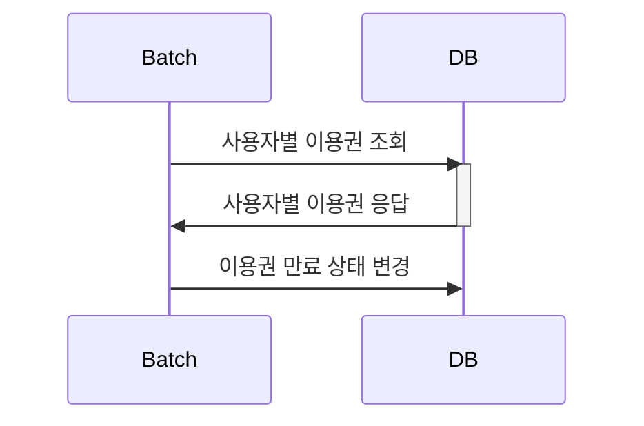
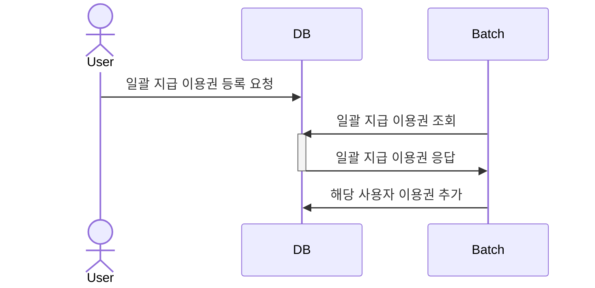
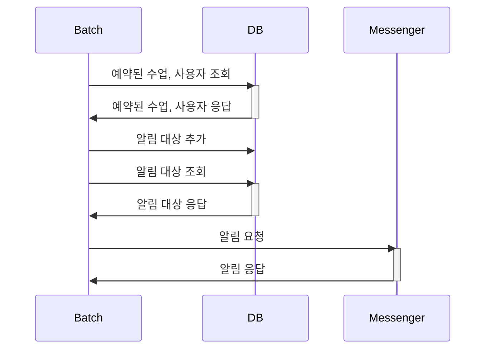
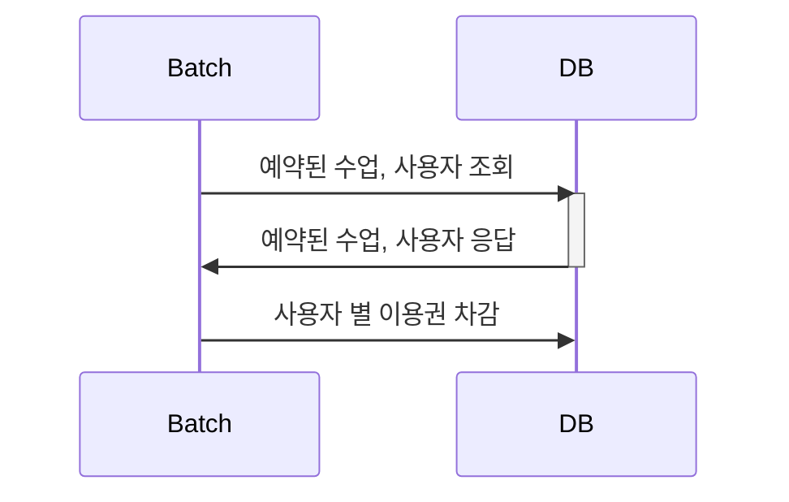

# pass-batch

PT 이용권 관리 서비스 내 배치 repository 입니다.
이용권 만료, 일괄 지급, 수업 전 알림, 수업 후 이용권 차감 기능을 제공합니다.

## Q&A 모음
* 기본적으로 질문 게시판에 코멘트로 답변드리고 있습니다.
* 답변의 내용이 이미지를 포함한 자세한 설명이 필요한 경우(e.g. 개발 환경에 대한 가이드) 다음 페이지에 추가 후 링크를 공유드리고 있습니다.
  * [kjs92980 > Q&A](https://kjs92980.github.io/categories/qa/)
* 혹시 같은 문제를 경험하고 있는 분들께 도움이 되길 바랍니다. 

## Environments
* OpenJDK 18.0.1 
* Spring Boot 2.7.3 
* Gradle 
* MySQL (Docker)
* JPA 
* lombok 
* ModelMapper

## Process
### 이용권 만료

### 이용권 일괄 지급

### 수업 전 알림

### 수업 후 이용권 차감

