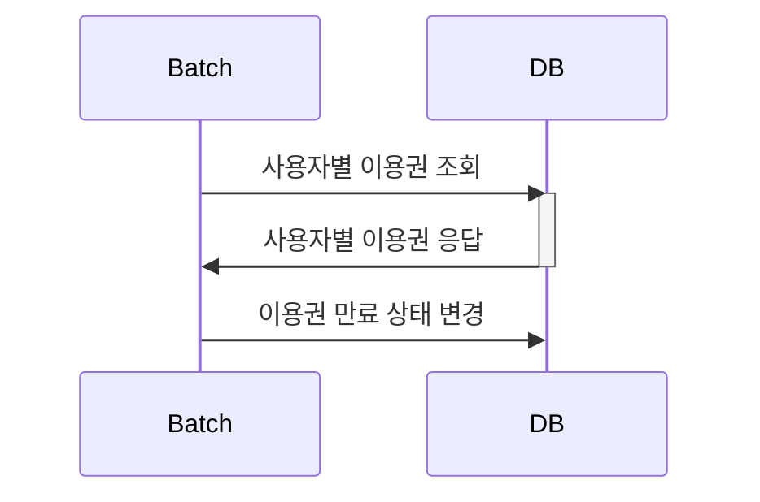
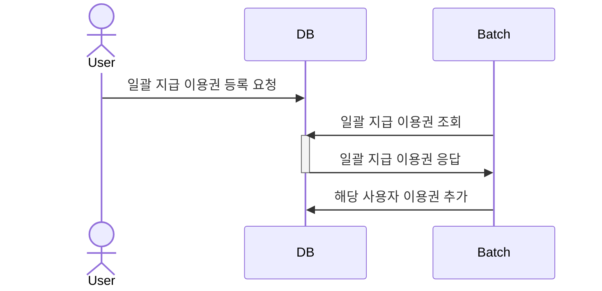
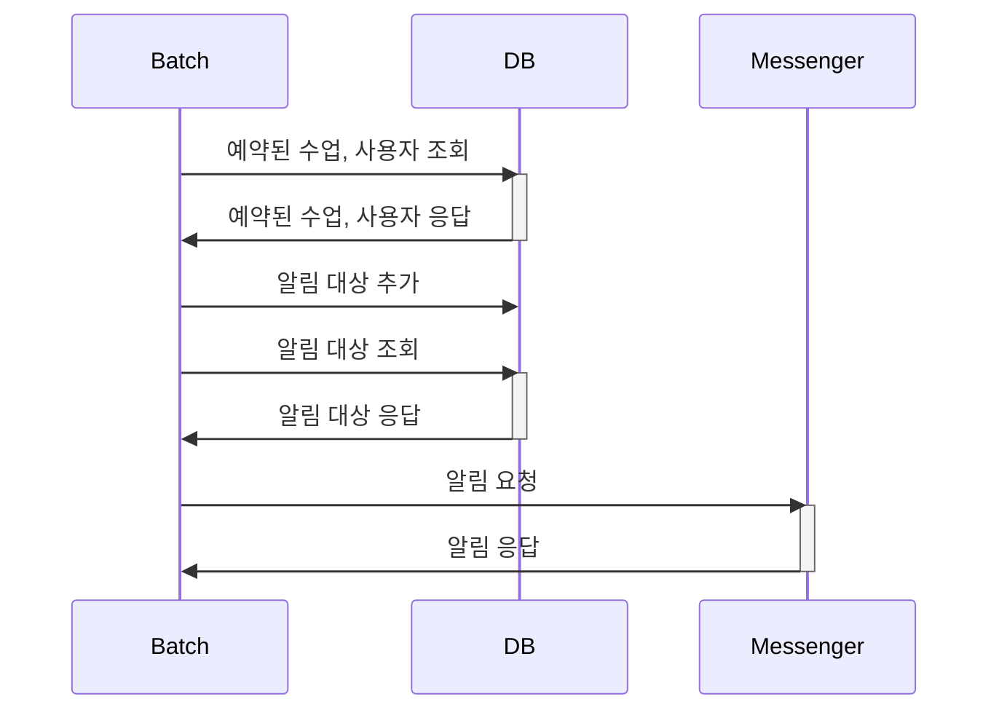
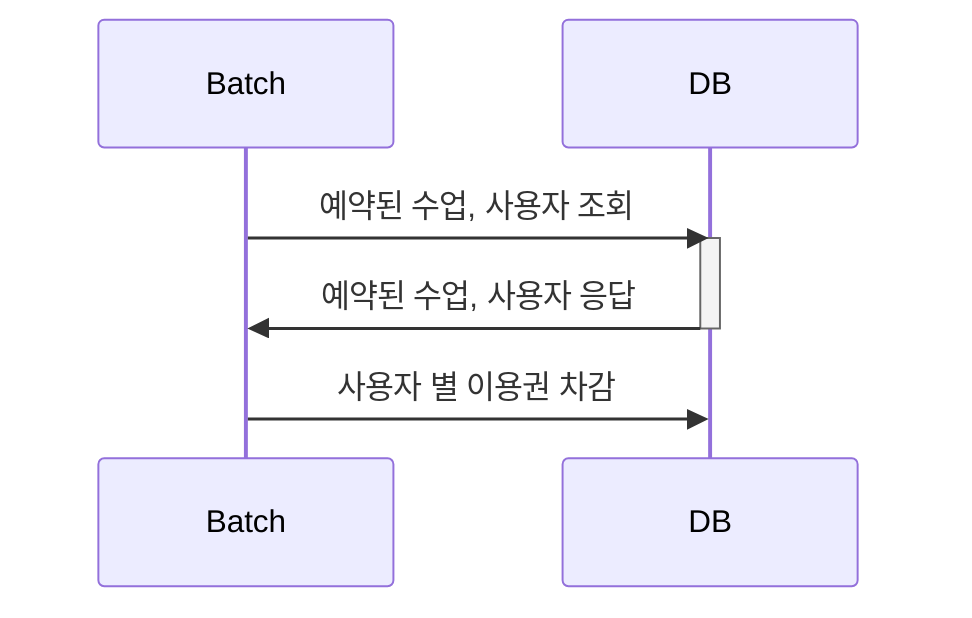

# pass-batch(spring boot3 version)

이 작업은 Spring Boot 2 버전에서 Spring Boot 3 버전으로 업그레이드하는 과정을 담고 있습니다.
업그레이드 과정은 공식 가이드를 기반으로 진행되었습니다.

* [Spring Boot 3.0 Migration Guide > Spring Batch Changes](https://github.com/spring-projects/spring-boot/wiki/Spring-Boot-3.0-Migration-Guide#spring-batch-changes)
* [Spring Batch 5.0 Migration Guide](https://github.com/spring-projects/spring-batch/wiki/Spring-Batch-5.0-Migration-Guide)
* [Hibernate 6.0 Migration Guide](https://docs.jboss.org/hibernate/orm/6.0/migration-guide/migration-guide.html)
* [vladmihalcea/hypersistence-utils > Migrating to version 3](https://github.com/vladmihalcea/hypersistence-utils)
* [MySQL Connector/J has new Maven Coordinates](https://blogs.oracle.com/mysql/post/mysql-connectorj-has-new-maven-coordinates)

## Environments
* OpenJDK 18.0.2 
* Spring Boot 3.2.2 
* Gradle 
* MySQL (Docker)
* JPA 
* lombok 
* ModelMapper

## Process
### 이용권 만료

### 이용권 일괄 지급

### 수업 전 알림

### 수업 후 이용권 차감

